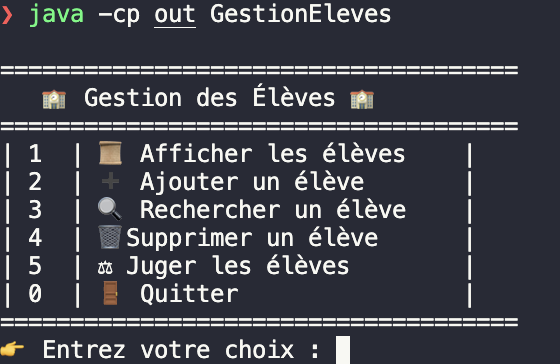
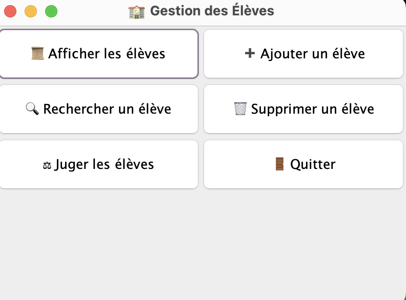

# Gestion des Élèves

## Description

Ce projet est une application en Java permettant de gérer un tableau d'élèves, avec des fonctionnalités comme l'ajout, la recherche, la suppression, et le jugement des élèves. Les informations des élèves (nom, prénom, classe, moyenne) sont stockées dans un fichier CSV pour permettre de conserver les données même après l'arrêt du programme.

## Fonctionnalités

- **Ajouter un élève** : Permet d'ajouter un nouvel élève avec ses informations personnelles (nom, prénom, classe, moyenne).
- **Afficher tous les élèves** : Affiche la liste de tous les élèves avec leurs informations.
- **Rechercher un élève** : Recherche un élève par son nom et affiche ses informations.
- **Supprimer un élève** : Supprime un élève du tableau en fonction de sa moyenne.
- **Jugement des élèves** : Évalue les élèves en fonction de leur moyenne. Si la moyenne est supérieure ou égale à 10, l'élève est déclaré "Réussi". Si elle est inférieure à 7, l'élève échoue, sinon l'élève se représente.
- **Sauvegarde et Chargement des données** : Les données des élèves sont sauvegardées dans un fichier CSV. Lors du démarrage, les données sont automatiquement chargées.

## Prérequis

- **Java** : Ce programme nécessite Java 8 ou une version supérieure pour être exécuté.
- **IDE** : Vous pouvez utiliser n'importe quel IDE compatible avec Java (par exemple, IntelliJ IDEA, Eclipse, ou Visual Studio Code).

## Installation

1. **Cloner ce dépôt** :
   ```bash
   git clone https://github.com/ton-utilisateur/gestion-eleves.git

## Compilation version bash

javac -d out src/*.java                                        
java -cp out GestionEleves


    Exemple une fois exécuté
-----------------------------
=====================================
   🏫 Gestion des Élèves 🏫
=====================================
| 1  | 📜 Afficher les élèves    |
| 2  | ➕ Ajouter un élève       |
| 3  | 🔍 Rechercher un élève    |
| 4  | 🗑 Supprimer un élève      |
| 5  | ⚖ Juger les élèves        |
| 0  | 🚪 Quitter                |
=====================================
👉 Entrez votre choix : 




## Compilation version bash

javac -d out src/*.java
java -cp out GestionElevesGUI


